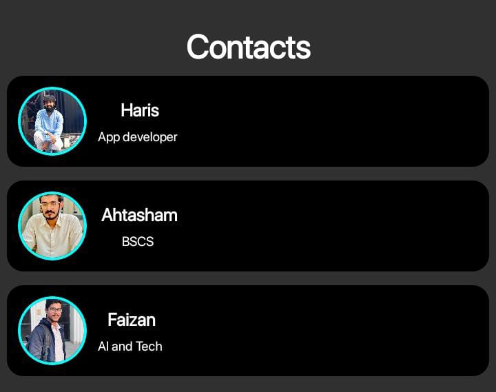
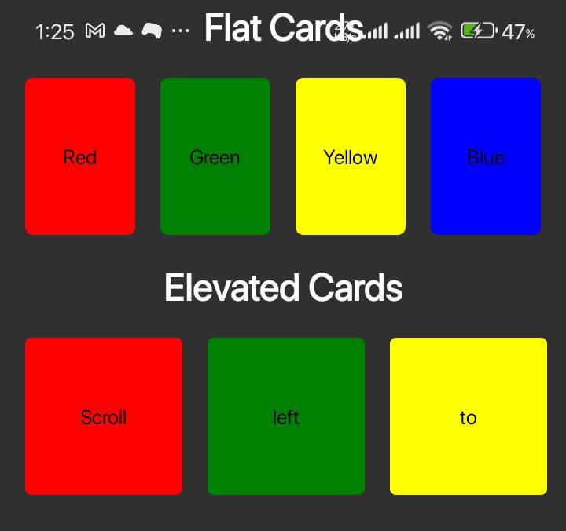

# 📱 AwesomeProject02 - React Native UI Showcase

This is my second React Native project built using **Expo** and **TypeScript**, showcasing various card components and UI interactions with clean styling and functionality. It’s designed to demonstrate real-world mobile UI components, links, and navigation experiences.

---

## 🚀 What I Built

### 🔸 1. **Simple Flat Cards**

Basic UI cards with static content to demonstrate foundational component layout.

### 🔸 2. **Horizontally Scrollable Cards**

A horizontally scrollable view of colorful cards showing flexibility and responsive layout.

### 🔸 3. **Famous Places Cards**

Stylized cards representing popular locations. This section focuses on layout — no interaction included (static design).

### 🔸 4. **Fancy Cards with “Read More”**

Dynamic cards showing blog previews or article summaries.

- ✅ Includes a **“Read More”** button
- 🔗 When clicked, it opens an external **website/blog link**

### 🔸 5. **Contact List (WhatsApp UI Inspired)**

Custom-styled contact list resembling WhatsApp UI.

- 🧑 When a **user taps on a contact’s name**, it opens the person’s **Instagram profile** via external linking.

---

## 📸 Screenshots

### 🧾 Fancy Cards with Read More

### 📇 WhatsApp-style Contact List with Insta Links

### 📦 Scrollable Cards

### 🔳 Action Cards

---

## 🛠 Tech Stack

- ⚛️ React Native (Expo)
- 💬 TypeScript + JavaScript
- 🖼 Static Image Assets
- 🌐 External Linking using `Linking` API
- 💡 Clean functional components

---

## 📂 Folder Structure

AwesomeProject02/
├── tests/
├── .bundle/
├── .vscode/
├── android/
├── ios/
├── Assets/
│ └── Images/
├── Components/
│ ├── FlatCards.jsx
│ ├── ElevatedCards.jsx
│ ├── FancyCard.jsx
│ ├── ActionCard.tsx
│ └── ContactList.tsx
├── screenshots/
│ ├── FancyCards.jpg
│ ├── ContactsActionCards.jpg
│ ├── ActionCards.jpg
│ └── SImpleAndScrollableCards.jpg
├── App.tsx
├── index.js
├── app.json
├── images.d.ts
├── README.md
├── package.json
├── tsconfig.json
├── .gitignore
└── (other config files)

---

## 👨‍💻 Author

**Muhammad Haris**  
📧 Email: hariskhokhar975@gmail.com  
🔗 GitHub: [@Muhammad-Haris-3](https://github.com/Muhammad-Haris-3)

---

## 💬 Future Improvements

- Add stack navigation between cards and contact views
- Introduce API-based dynamic data
- Create a sharable APK or PWA

---

## 📌 License

This project is licensed under the **MIT License** — feel free to use and build on it.
